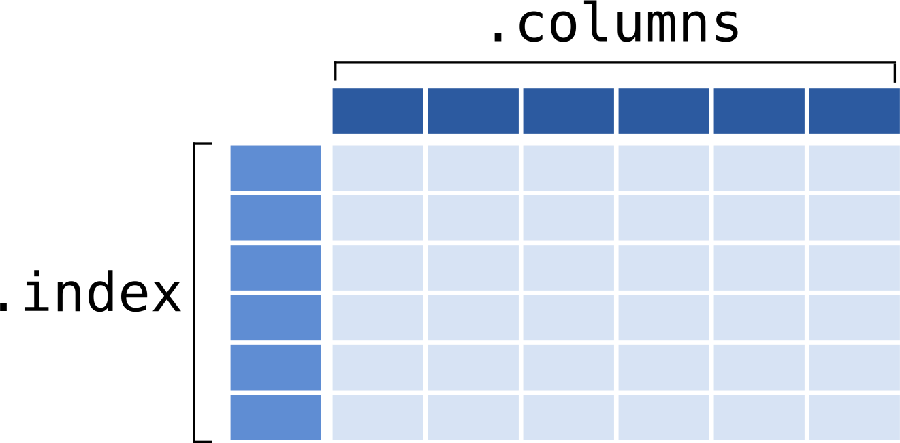

---
jupytext:
  text_representation:
    extension: .md
    format_name: myst
    format_version: 0.13
    jupytext_version: 1.11.1
kernelspec:
  display_name: Python 3
  language: python
  name: python3
---

<p><font size="6"><b>01 - Pandas: Data Structures </b></font></p>


> *DS Data manipulation, analysis and visualisation in Python*  
> *December, 2019*

> *© 2016-2019, Joris Van den Bossche and Stijn Van Hoey  (<mailto:jorisvandenbossche@gmail.com>, <mailto:stijnvanhoey@gmail.com>). Licensed under [CC BY 4.0 Creative Commons](http://creativecommons.org/licenses/by/4.0/)*

---

```{code-cell} ipython3
import pandas as pd
```

```{code-cell} ipython3
import numpy as np
import matplotlib.pyplot as plt
```

# Introduction

+++

Let's directly start with importing some data: the `titanic` dataset about the passengers of the Titanic and their survival:

```{code-cell} ipython3
df = pd.read_csv("../data/titanic.csv")
```

```{code-cell} ipython3
df.head()
```

Starting from reading such a tabular dataset, Pandas provides the functionalities to answer questions about this data in a few lines of code. Let's start with a few examples as illustration:

+++

<div class="alert alert-warning">

 <ul>
  <li>What is the age distribution of the passengers?</li>
</ul> 

</div>

```{code-cell} ipython3
df['Age'].hist()
```

<div class="alert alert-warning">

 <ul>
  <li>How does the survival rate of the passengers differ between sexes?</li>
</ul> 

</div>

```{code-cell} ipython3
df.groupby('Sex')[['Survived']].aggregate(lambda x: x.sum() / len(x))
```

<div class="alert alert-warning">

 <ul>
  <li>Or how does the survival rate differ between the different classes of the Titanic?</li>
</ul> 

</div>

```{code-cell} ipython3
df.groupby('Pclass')['Survived'].aggregate(lambda x: x.sum() / len(x)).plot(kind='bar')
```

<div class="alert alert-warning">

 <ul>
  <li>Are young people (e.g. < 25 years) likely to survive?</li>
</ul> 

</div>

```{code-cell} ipython3
df['Survived'].sum() / df['Survived'].count()
```

```{code-cell} ipython3
df25 = df[df['Age'] <= 25]
df25['Survived'].sum() / len(df25['Survived'])
```

All the needed functionality for the above examples will be explained throughout the course, but as a start: the data types to work with.

+++

# The pandas data structures: `DataFrame` and `Series`

Pandas provides two fundamental data objects, for 1D (``Series``) and 2D data (``DataFrame``).

+++

## DataFrame: 2D tabular data

+++

A `DataFrame` is a **tablular data structure** (multi-dimensional object to hold labeled data) comprised of rows and columns, akin to a spreadsheet, database table, or R's data.frame object. You can think of it as multiple Series object which share the same index.



+++

For the examples here, we are going to create a small DataFrame with some data about a few countries.

When creating a DataFrame manually, a common way to do this is from dictionary of arrays or lists:

```{code-cell} ipython3
data = {'country': ['Belgium', 'France', 'Germany', 'Netherlands', 'United Kingdom'],
        'population': [11.3, 64.3, 81.3, 16.9, 64.9],
        'area': [30510, 671308, 357050, 41526, 244820],
        'capital': ['Brussels', 'Paris', 'Berlin', 'Amsterdam', 'London']}
countries = pd.DataFrame(data)
countries
```

In practice, you will of course often import your data from an external source (text file, excel, database, ..), which we will see later.

Note that in the IPython notebook, the dataframe will display in a rich HTML view.

+++

### Attributes of the DataFrame

The DataFrame has a built-in concept of named rows and columns, the **`index`** and **`columns`** attributes:

```{code-cell} ipython3
countries.index
```

By default, the index is the numbers *0* through *N - 1*

```{code-cell} ipython3
countries.columns
```

To check the data types of the different columns:

```{code-cell} ipython3
countries.dtypes
```

An overview of that information can be given with the `info()` method:

```{code-cell} ipython3
countries.info()
```

<div class="alert alert-info">

__NumPy__ provides

* multi-dimensional, homogeneously typed arrays  (single data type!)

<br>

__Pandas__ provides

* 2D, heterogeneous data structure (multiple data types!)
* labeled (named) row and column index

</div>

+++

## One-dimensional data: `Series` (a column of a DataFrame)

A Series is a basic holder for **one-dimensional labeled data**. It can be created much as a NumPy array is created:

```{code-cell} ipython3
s = pd.Series([0.1, 0.2, 0.3, 0.4])
s
```

And often, you access a Series representing a column in the data, using typical `[]` indexing syntax and the column name:

```{code-cell} ipython3
countries['area']
```

### Attributes of a Series: `index` and `values`

The series also has an **index**, which by default is the numbers *0* through *N - 1* (but no `.columns`):

```{code-cell} ipython3
s.index
```

You can access the underlying numpy array representation with the `.values` attribute:

```{code-cell} ipython3
s.values
```

We can access series values via the index, just like for NumPy arrays:

```{code-cell} ipython3
s[0]
```

Unlike the NumPy array, though, this index can be something other than integers:

```{code-cell} ipython3
s2 = pd.Series(np.arange(4), index=['a', 'b', 'c', 'd'])
s2
```

```{code-cell} ipython3
s2['c']
```

### Pandas Series versus dictionaries

+++

In this way, a ``Series`` object can be thought of as similar to an ordered dictionary mapping one typed value to another typed value.

In fact, it's possible to construct a series directly from a Python dictionary:

```{code-cell} ipython3
pop_dict = {'Germany': 81.3, 
            'Belgium': 11.3, 
            'France': 64.3, 
            'United Kingdom': 64.9, 
            'Netherlands': 16.9}
population = pd.Series(pop_dict)
population
```

We can index the populations like a dict as expected ...

```{code-cell} ipython3
population['France']
```

... but with the power of numpy arrays. Many things you can do with numpy arrays, can also be applied on DataFrames / Series.

Eg element-wise operations:

```{code-cell} ipython3
population * 1000
```

## Some useful methods on these data structures

+++

Exploration of the Series and DataFrame is essential (check out what you're dealing with). 

```{code-cell} ipython3
countries.head() # Top rows
```

```{code-cell} ipython3
countries.tail() # Bottom rows
```

The ``describe`` method computes summary statistics for each column:

```{code-cell} ipython3
countries.describe()
```

**Sort**ing your data **by** a specific column is another important first-check:

```{code-cell} ipython3
countries.sort_values(by='population')
```

The **`plot`** method can be used to quickly visualize the data in different ways:

```{code-cell} ipython3
countries.plot()
```

However, for this dataset, it does not say that much:

```{code-cell} ipython3
countries['population'].plot(kind='barh')
```

<div class="alert alert-success">

**EXERCISE**:

* You can play with the `kind` keyword of the `plot` function in the figure above: 'line', 'bar', 'hist', 'density', 'area', 'pie', 'scatter', 'hexbin', 'box'

</div>

+++

# Importing and exporting data

+++

A wide range of input/output formats are natively supported by pandas:

* CSV, text
* SQL database
* Excel
* HDF5
* json
* html
* pickle
* sas, stata
* Parquet
* ...

```{code-cell} ipython3
# pd.read_
```

```{code-cell} ipython3
# countries.to_
```

<div class="alert alert-info">

**Note: I/O interface**

* All readers are `pd.read_...`
* All writers are `DataFrame.to_...`

</div>

+++

# Application on a real dataset

+++

Throughout the pandas notebooks, many of exercises will use the titanic dataset. This dataset has records of all the passengers of the Titanic, with characteristics of the passengers (age, class, etc. See below), and an indication whether they survived the disaster.


The available metadata of the titanic data set provides the following information:

VARIABLE   |  DESCRIPTION
------ | --------
Survived       | Survival (0 = No; 1 = Yes)
Pclass         | Passenger Class (1 = 1st; 2 = 2nd; 3 = 3rd)
Name           | Name
Sex            | Sex
Age            | Age
SibSp          | Number of Siblings/Spouses Aboard
Parch          | Number of Parents/Children Aboard
Ticket         | Ticket Number
Fare           | Passenger Fare
Cabin          | Cabin
Embarked       | Port of Embarkation (C = Cherbourg; Q = Queenstown; S = Southampton)

+++

<div class="alert alert-success">

**EXERCISE**:

* Read the CVS file (available at `../data/titanic.csv`) into a pandas DataFrame. Call the result `df`.

</div>

```{code-cell} ipython3
:clear_cell: true

df = pd.read_csv("../data/titanic.csv")
```

<div class="alert alert-success">

**EXERCISE**:

* Quick exploration: show the first 5 rows of the DataFrame.

</div>

```{code-cell} ipython3
:clear_cell: true

df.head()
```

<div class="alert alert-success">

**EXERCISE**:

* How many records (i.e. rows) has the titanic dataset?

<details><summary>Hints</summary>

* The length of a DataFrame gives the number of rows (`len(..)`). Alternatively, you can check the "shape" (number of rows, number of columns) of the DataFrame using the `shape` attribute. 

</details>
</div>

```{code-cell} ipython3
:clear_cell: true

len(df)
```

<div class="alert alert-success">
    <b>EXERCISE</b>:

* Select the 'Age' column (remember: we can use the [] indexing notation and the column label).

</div>

```{code-cell} ipython3
:clear_cell: true

df['Age']
```

<div class="alert alert-success">
    <b>EXERCISE</b>:

* Make a box plot of the Fare column.

</div>

```{code-cell} ipython3
:clear_cell: true

df['Fare'].plot(kind='box')
```

<div class="alert alert-success">
    
**EXERCISE**:

* Sort the rows of the DataFrame by 'Age' column, with the oldest passenger at the top. Check the help of the `sort_values` function and find out how to sort from the largest values to the lowest values

</div>

```{code-cell} ipython3
:clear_cell: true

df.sort_values(by='Age', ascending=False)
```

---
# Acknowledgement


> This notebook is partly based on material of Jake Vanderplas (https://github.com/jakevdp/OsloWorkshop2014).
