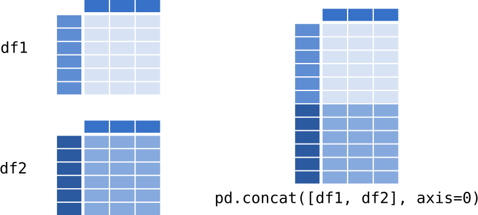
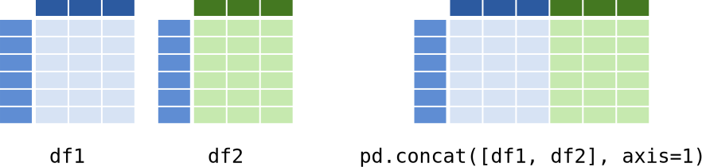

---
jupytext:
  text_representation:
    extension: .md
    format_name: myst
    format_version: 0.13
    jupytext_version: 1.11.1
kernelspec:
  display_name: Python 3
  language: python
  name: python3
---

<p><font size="6"><b>Pandas: Combining datasets Part I - concat</b></font></p>

> *DS Data manipulation, analysis and visualisation in Python*  
> *December, 2019*

> *© 2016-2019, Joris Van den Bossche and Stijn Van Hoey  (<mailto:jorisvandenbossche@gmail.com>, <mailto:stijnvanhoey@gmail.com>). Licensed under [CC BY 4.0 Creative Commons](http://creativecommons.org/licenses/by/4.0/)*

---

```{code-cell} ipython3
import pandas as pd
```

Combining data is essential functionality in a data analysis workflow. 

Data is distributed in multiple files, different information needs to be merged, new data is calculated, .. and needs to be added together. Pandas provides various facilities for easily combining together Series and DataFrame objects

```{code-cell} ipython3
# redefining the example objects

# series
population = pd.Series({'Germany': 81.3, 'Belgium': 11.3, 'France': 64.3, 
                        'United Kingdom': 64.9, 'Netherlands': 16.9})

# dataframe
data = {'country': ['Belgium', 'France', 'Germany', 'Netherlands', 'United Kingdom'],
        'population': [11.3, 64.3, 81.3, 16.9, 64.9],
        'area': [30510, 671308, 357050, 41526, 244820],
        'capital': ['Brussels', 'Paris', 'Berlin', 'Amsterdam', 'London']}
countries = pd.DataFrame(data)
countries
```

# Adding columns

+++

As we already have seen before, adding a single column is very easy:

```{code-cell} ipython3
pop_density = countries['population']*1e6 / countries['area']
```

```{code-cell} ipython3
pop_density
```

```{code-cell} ipython3
countries['pop_density'] = pop_density
```

```{code-cell} ipython3
countries
```

Adding multiple columns at once is also possible. For example, the following method gives us a DataFrame of two columns:

```{code-cell} ipython3
countries["country"].str.split(" ", expand=True)
```

We can add both at once to the dataframe:

```{code-cell} ipython3
countries[['first', 'last']] = countries["country"].str.split(" ", expand=True)
```

```{code-cell} ipython3
countries
```

# Concatenating data

+++

The ``pd.concat`` function does all of the heavy lifting of combining data in different ways.

``pd.concat`` takes a list or dict of Series/DataFrame objects and concatenates them in a certain direction (`axis`) with some configurable handling of “what to do with the other axes”.

+++

## Combining rows - ``pd.concat``

+++



+++

Assume we have some similar data as in `countries`, but for a set of different countries:

```{code-cell} ipython3
data = {'country': ['Nigeria', 'Rwanda', 'Egypt', 'Morocco', ],
        'population': [182.2, 11.3, 94.3, 34.4],
        'area': [923768, 26338 , 1010408, 710850],
        'capital': ['Abuja', 'Kigali', 'Cairo', 'Rabat']}
countries_africa = pd.DataFrame(data)
countries_africa 
```

We now want to combine the rows of both datasets:

```{code-cell} ipython3
pd.concat([countries, countries_africa])
```

If we don't want the index to be preserved:

```{code-cell} ipython3
pd.concat([countries, countries_africa], ignore_index=True)
```

When the two dataframes don't have the same set of columns, by default missing values get introduced:

```{code-cell} ipython3
pd.concat([countries, countries_africa[['country', 'capital']]], ignore_index=True)
```

We can also pass a dictionary of objects instead of a list of objects. Now the keys of the dictionary are preserved as an additional index level:

```{code-cell} ipython3
pd.concat({'europe': countries, 'africa': countries_africa})
```

## Combining columns  - ``pd.concat`` with ``axis=1``

+++



+++

Assume we have another DataFrame for the same countries, but with some additional statistics:

```{code-cell} ipython3
data = {'country': ['Belgium', 'France', 'Netherlands'],
        'GDP': [496477, 2650823, 820726],
        'area': [8.0, 9.9, 5.7]}
country_economics = pd.DataFrame(data).set_index('country')
country_economics
```

```{code-cell} ipython3
pd.concat([countries, country_economics], axis=1)
```

`pd.concat` matches the different objects based on the index:

```{code-cell} ipython3
countries2 = countries.set_index('country')
```

```{code-cell} ipython3
countries2
```

```{code-cell} ipython3
pd.concat([countries2, country_economics], axis=1)
```

# Joining data with `pd.merge`

+++

Using `pd.concat` above, we combined datasets that had the same columns or the same index values. But, another typical case if where you want to add information of second dataframe to a first one based on one of the columns. That can be done with [`pd.merge`](http://pandas.pydata.org/pandas-docs/stable/generated/pandas.DataFrame.merge.html).

Let's look again at the titanic passenger data, but taking a small subset of it to make the example easier to grasp:

```{code-cell} ipython3
df = pd.read_csv("../data/titanic.csv")
df = df.loc[:9, ['Survived', 'Pclass', 'Sex', 'Age', 'Fare', 'Embarked']]
```

```{code-cell} ipython3
df
```

Assume we have another dataframe with more information about the 'Embarked' locations:

```{code-cell} ipython3
locations = pd.DataFrame({'Embarked': ['S', 'C', 'Q', 'N'],
                          'City': ['Southampton', 'Cherbourg', 'Queenstown', 'New York City'],
                          'Country': ['United Kindom', 'France', 'Ireland', 'United States']})
```

```{code-cell} ipython3
locations
```

We now want to add those columns to the titanic dataframe, for which we can use `pd.merge`, specifying the column on which we want to merge the two datasets:

```{code-cell} ipython3
pd.merge(df, locations, on='Embarked', how='left')
```

In this case we use `how='left` (a "left join") because we wanted to keep the original rows of `df` and only add matching values from `locations` to it. Other options are 'inner', 'outer' and 'right' (see the [docs](http://pandas.pydata.org/pandas-docs/stable/merging.html#brief-primer-on-merge-methods-relational-algebra) for more on this).
